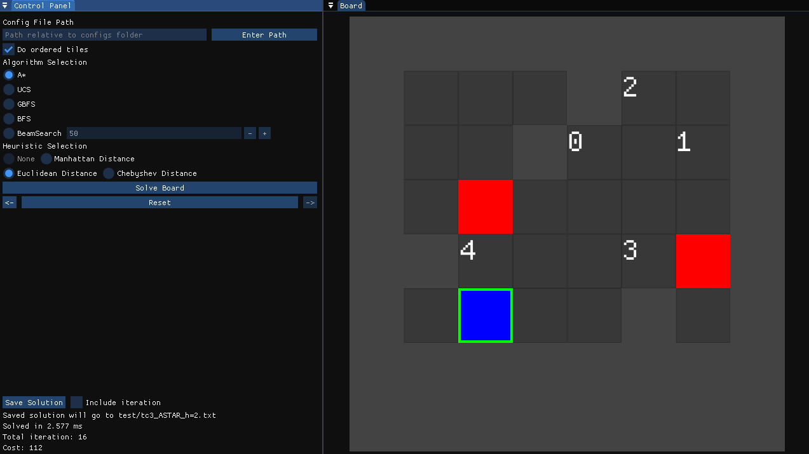

# Tucil3_13524003_13524024

# Project Description

This project contains a gamified simulation of common pathfinding algorithms like A*, Uniform Cost Search, Greedy Best First Search, and others. The algorithms are implemented in a puzzle board game where an object (named as a pin) is sliding through the board without the capability of stopping; needing to hit a wall to stop its movement to one direction. 



# Dependancies: OpenGL & GLFW
To install these dependancies (on Linux or WSL):
```bash
sudo apt update
sudo apt install libglfw3-dev libgl1-mesa-dev xorg-dev
```

# How to compile and run
## Running on native machine
Open terminal on project folder
```bash
cd build #(do "mkdir build" if it doesn't exist yet)
cmake ..
make all
```
## Running through Docker
If you are running through WSL, and assuming you have docker installed, you can immediately use the run script by
```bash
./run.sh
```

Alternatively, if the script fails, run this on terminal (project folder):
```bash
xhost +local:docker
docker build -t iceslide .
docker run -it --rm \
    -e DISPLAY=$DISPLAY \
    -e WAYLAND_DISPLAY=$WAYLAND_DISPLAY \
    -e XDG_RUNTIME_DIR=/mnt/wslg/runtime-dir \
    -v /tmp/.X11-unix:/tmp/.X11-unix \
    -v /mnt/wslg:/mnt/wslg \
    -v "$(pwd)/configs:/app/configs" \
    -v "$(pwd)/test:/app/test" \
    iceslide
```

Note that this script is specifically for WSL and NOT native linux. This is because there is a difference on how to run a docker and forwards the display to you host machine on WSL and on native linux.

Also this is a heavy script because docker will need to install g++ and cmake to its container. So expect longer launch time for the price of convenience.

# How to Use
After running the executable, insert the name of a configuration file to solve inside the top left text box. Configuration files can be seen on configs folder. Click "Enter Path" button besides the text box to load the configuration file.

After that, check/uncheck the "Do ordered tiles" checkbox if the solution should go through all ordered tiles (tiles with numbers in it) or not. Select algorithm to use and its heuristic (and the value of BeamSearch if selected). Then, press "Solve Board" button to solve the configuration with selected algorithm.

The solution will be stored in the program and can be traversed using "<-" and "->" button. Press "Reset" button to get back to the initial board.

The solution can be saved into a txt file to the test folder using "Save Solution" button. Check/uncheck "Include iteration" checkbox to include/exclude iteration process in the output file.

# Authors:
- Faiq Azzam Nafidz (13524003)
- Billie Bhaskara Wibawa (13524024)